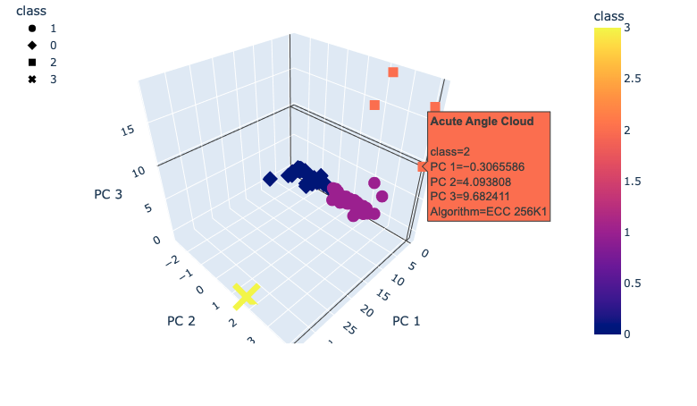

# Cryptocurrencies

## Unsupervised Machine Learning
## Overview 
This data analytics project uses unsupervised machine learning to analyze cryptocurrencies traded in the market.  We preprocessed the data using Python's Pandas to get it ready for PCA (Principal Component Analysis).  We used PCA to reduce the features down to 3, then used the clustering K-means algorithm to group the cryptocurrencies into 4 groups.  Finally we used 2D and 3D plots to visualize our data, based on the PCA features.  

## Goals
- Preprocess the Data for PCA
- Reduce Data Dimensions Using PCA
- Cluster the Cryptocurrencies Using K-means
- Visualize the Cryptocurrencies Results

## Resources
- Data Source: [crypto_data.csv](./Resources/crypto_data.csv)
- Software: Python 3.7.9, Jupyter Notebook 6.0.3, Pandas, Hvplot, Plotly  

Data Visualizion 

3D scatter plot using Plotly to give a graphic display of the clusters determined using the K-means algorithm using with the 3 PCA features from our cryptocurrencies dataframe.

